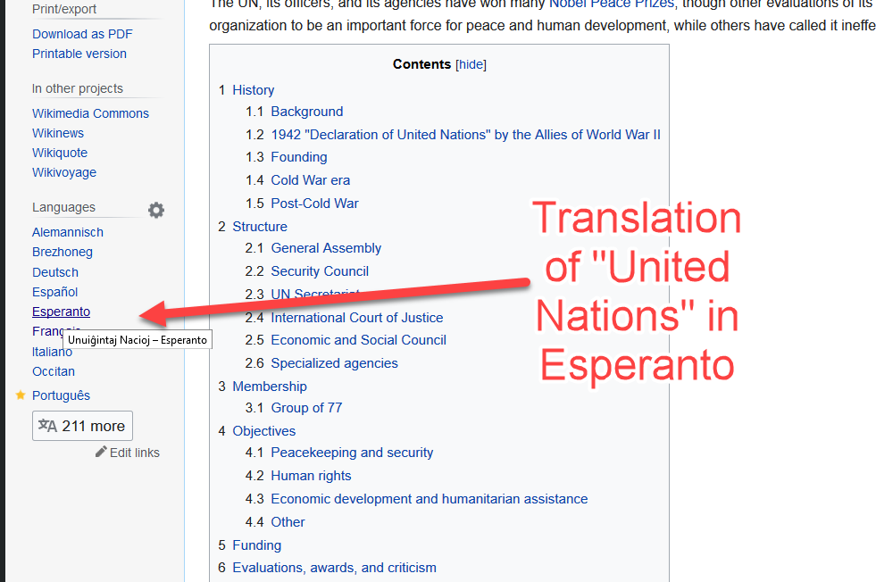

# Wiki-Translate: a Translation Dictionary in Emacs, using Wikipedia

Do you ever look for the translation of a name by looking it up on Wikipedia,  then clicking on "Languages" and hovering on the language you're interested in to see the translation?

This snippet of code automates it for you, inside Emacs.

Just specify the languages you're interested in (variable `wiki-translate-languages`). For each language pair, the code automatically creates a function to translate from and to this language. For instance, if you specify english (en), german (de) and russian (ru), it creates the functions `en-de`, `en-ru`, `de-en`,`de-ru`, `ru-en`, and `ru-de`. 

Calling the functions with C-u opens the Wikipedia page of the translation.

Autocompletion is available (I recommand helm).

## Behaviour and example usage

- How do you say *rabbit* in french ? `M-x` `en-fr` `rabbit` gives you the answer.
- `M-x` `en-eo` `Russia` looks for the translation of *Russia* in Esperanto and displays the result (*Rusio*) in the minibuffer.
- `C-u` `M-x` `pt-ja` `Coimbra` looks for the japanese translation of the portuguese name *Coimbra*, displays it in the minibuffer, and opens the [japanese page](https://ja.wikipedia.org/wiki/%E3%82%B3%E3%82%A4%E3%83%B3%E3%83%96%E3%83%A9) dedicated to it.

## How does it work?

Wiki-translate is written entirely in Elisp, and uses the following Wikipedia APIs:

- Word selection and auto-completion in the input language: listing API.  
Example: Complete the word "Foundatio" in english:  
https://en.wikipedia.org/w/api.php?action=query&list=allpages&apprefix=Foundatio&formatversion=2&aplimit=15&format=json

- Translation: query API on the input language Wikipedia.  
Example: Translate the french town "Vérone" in english:  
https://fr.wikipedia.org/w/api.php?action=query&prop=langlinks&titles=Vérone&lllang=en&formatversion=2&redirects&format=json

## Possible improvements?

- Find a way to unset `debug-on-error` inside `generic-interactive-wiki-translate` (see code)
- Evaluate if https://en.wikipedia.org/w/api.php?action=opensearch&search=Ivan%C2%A0Ill isn't a better API for the input language. That's the one used by helm-wikipedia.
- Should we offer to open the Wikipedia page in the browser *after* the translation?
- Code cleaning: should-we split get-ws-json in the same way it was done on [this](https://github.com/AccelerationNet/cl-mediawiki/blob/master/src/main.lisp) project?
- Should we rename all functions with a customizable string prefix, by default *wiki-translate*?

